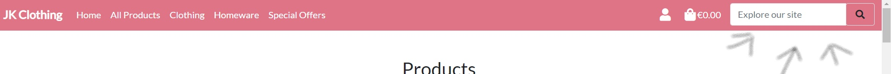
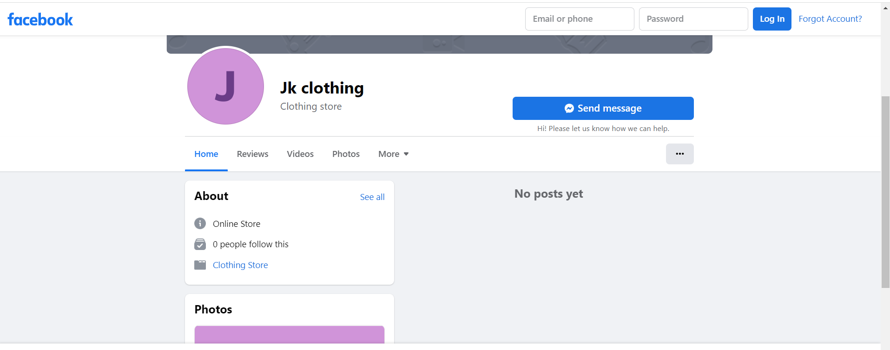
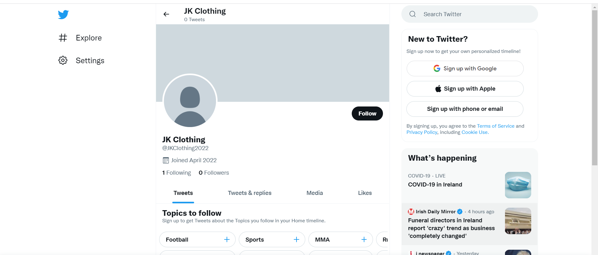
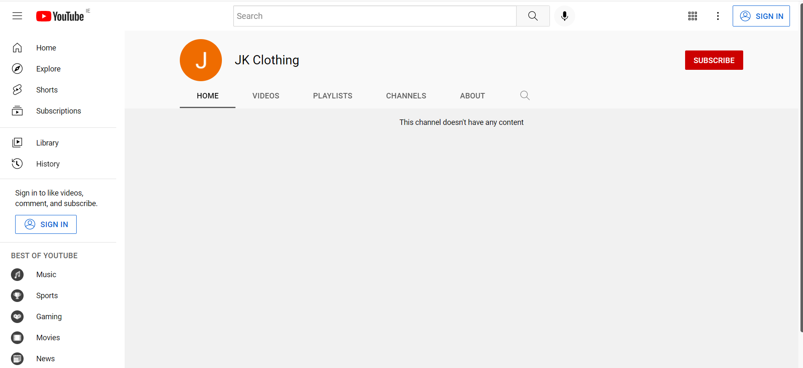

# JK Clothing
---
Develpoer: JKCC

JK Clothing is an online store where user and shoppers can view all the products, sort them out according to category, alphabetically and by their prices. The owner believes fashion is very important to todays world where you can express your feelings and emotions. Mix and match and show what your feeling through fashion. Users and shoppers also have the option to create an account, sign in to same and add products to their bag and securely checking out using stripe. Everyone is welcome and happy shopping!

[Go to the website](https://jk-clothing.herokuapp.com/)

---

---
## Table of Contents
---
1. [Goals](#goals)
    * [Users Goals](#user-goals)
    * [Developer Goals](#owner-goals)
2. [User Experience](#user-experience)
    * [Target Crowd](#target-crowd)
    * [User Requirements and Expectation](#user-requirements-expectation)
    * [User Stories](#user-stories)
    * [Site Owner Story](#site-owner)
3. [Technologies Used](#technology)
    * [Languages](#languages)
    * [Frameworks and Tools](#frameworks)
4. [Features](#features)
    * [Home Page](#home)
    * [Register Page](#register)
    * [Login Page](#login)
    * [Logout Page](#logout)
    * [All Products Page](#all-products)
    * [Product Details Page](#product-details)
    * [Clothing Page](#clothing)
    * [Homeware Page](#homeware)
    * [Special Offers Page](#specials)
    * [Profile Page](#profile)
    * [Product Management Page](#management)
    * [Shopping Bag Page](bag)
    * [Checkout Page](#checkout)
    * [Reset Password Page](#reset)
    * [Explore the site](#search)
5. [Validation](#validation)
    * [PEP8 Validation](#pep)
    * [HTML Validation](#html)
    * [CSS Validation](#css)
    * [Javascript Validation](#js)
    * [User Stories Testing](#stories)
    * [Site Owner Story Testing](#owner)
6. [Bugs](#bugs)
7. [Deployment](#deployment)
8. [Credits](#credits)
9. [Acknowledgement](#acknowledgement)

---
## Goals
### User/Shoppers Goals
* To be able to view all products and each individual products with its details.
* To quickly identify special offers and clearance items.
* To be able to create an account, log in and log out with email verifications to ensure safety of account.
* To be able to securely checkout when purchasing items from the shop
* To easily recover password in case users forgot it.
* To have a personalized user profile after registering for an account.
* To easily view all the items in the shopping bag.
* To be able to sort out products according to category, prices and alphabetical order.
* To be able to search for products by name or description.
* To easily select size and quantity of a product when purchasing.

### Developer Goals
* To put up a template for in case in the future someone will ask the developer to do an online shop.
---

## User Experience

---
### Target Crowd
* Anyone that loves to shop and are willing to mix and match stuff to show their emotions and feeling through fashion.
* Whoever has the capacity to buy items using a verified credit card.

### User Requirements and Expectations
* Average level of knowledge about computers and online shopping.
* Ability to input data.
* Easy to use
* Easily log in and out
* Easily create an account with email verification.
* Easiyly view all the products and have prompts to easily know whats happening or what has been done.

### User/Shopper Stories
* To be able to view all products and each individual products with its details.
* To quickly identify special offers and clearance items.
* To be able to create an account, log in and log out with email verifications to ensure safety of account.
* To be able to securely checkout when purchasing items from the shop
* To easily recover password in case users forgot it.
* To have a personalized user profile after registering for an account.
* To easily view all the items in the shopping bag.
* To be able to sort out products according to category, prices and alphabetical order.
* To be able to search for products by name or description.
* To easily select size and quantity of a product when purchasing.
* To be able to see purchase history
### Site Owner Story
1. As the site owner, I want to be able to have an admin account so I can add, edit and delete products accordingly.
2. As the site owner, I want to be able to see all the users that has registered for an account and all the orders that has been done on the shop.

---
## Technologies Used
### Languages
* Python-Django
* HTML
* CSS
* Javascript

### Framework and Tools
* Bootstrap5 - for the site design on desktop and mobile to be responsive.
* Fontawesome - for the overall font for the site
* Github - used for storing the code for the site in a repositoty so other developers can see, fork and check it out.
* Gitpod - the IDE used when developing the site
* AWS-S3 - where all the static and media files are stored
* Stripe - the payment system used when checking out
* Heroku - where the app is deployed
---
## Features
### Website Pages
The website is structured into pages, each with clear, concise structure, information and purpose. I use the Bootstrap grid system throughout, which gave a consistent structure and responsive design.
1. Home/Landing Page: This is the landing page, and the first page the user encounters when they access the site, before they log in/register. This uses a carousel template with some changes from bootstrap5.

2. Register: This page allows the user to register an account

3. Login: This page allows the user to login to the site

4. Logout: This page allows the user to logout the site

5. All products: This page shows all the products available on the shop.

6. Product Details: This page shows the details of a specific product.

7. Clothing page: This page shows the clothing items on the shop.

8. Homeware Page: This page shows all the hardware items on the shop.

9. Special offers: This page shows all items that are on clearance and special offers/sale.

10. Profile: This page is where shoppers with a registered account can edit their profiles accordingly.

11. Product Management: This page allows the site owner to easily edit, add and delete items from the shop.

12. Shopping bag: This page shows all the items the shopper wants to buy.

13. Checkout: This page is where users/shoppers put their payment details in order for them to purchase items from the shop.

14. Reset Password: This page is where users/shoppers go to reset their password if they forgot it.

15. Search or explore the site: This page is where users/shoppers go to search for items vie name or description.

---
## Validation
### PEP8 Validation
* http://pep8online.com/ was use to validate the python code written. Result came back with warnings of line of code too long. I am not sure how to fix them without ruining the site or it might not work if I edit it. Will try and learn how to do this in the future as for now, due to time constraints, I will leave it be as it is not affecting the overall performance of the site.
On one hand, with regards to Unitest, I am still not sure how to do this so I wasnt able to include any of these in the code. Will learn about this more in the future when I have more time to focus on it.
### HTML Validation
* https://validator.w3.org/ was used to check the html files on this site. According to the site, there are 8 errors on this site. 6 of these said the duplicate id's, but when I checked the code, it says that I used duplicate id but this id was used for a dropdown options. 2 of these error said that form are not allowed to be a child of an ul. Tried to fix it but the overall look of the site change, so I kept it knowing and being aware of the error and will learn in the future not to do this. For now, due to time constraint, I will leave it be as the this error is not affecting the seach function of the site.
### CSS Validation
* https://jigsaw.w3.org/css-validator/ was used to check all the CSS files on this site. There were no errors or warnings found.
### JS Validation
* https://jshint.com was used to check the Javascript files used in this site. There were 5 warnings about template literal only available in ES6
## User/Shopper Stories Testing
1. To be able to view all products and each individual products with its details.

| Feature      | Action    | Result    |
| :------------- | :----------: | -----------: |
| Products page | When you opened the app, and click on the all products option a dropdown will show and click all products. Click on the picture of the product and will show the product details.   | Worked    |

2. To quickly identify special offers and clearance items.

| Feature      | Action    | Result    |
| :------------- | :----------: | -----------: |
| Special offers page | When you opened the app, and click on the special offers option a dropdown will show for all the special offers, sale and clearance products.  | Worked    |

3. To be able to create an account, log in and log out with email verifications to ensure safety of account.

| Feature      | Action    | Result    |
| :------------- | :----------: | -----------: |
| My account page | When you opened the app, and click on the my account option a dropdown will show to either log in or sign up.  | Worked    |

4. * To be able to securely checkout when purchasing items from the shop

| Feature      | Action    | Result    |
| :------------- | :----------: | -----------: |
| Checkout page | When you opened the app, and chose an item to add in your bag, and select checkout button. | Worked    |

5. To easily recover password in case users forgot it.

| Feature      | Action    | Result    |
| :------------- | :----------: | -----------: |
| Reset Password page | When you forgot your password when logging in, choose the forgot password option and enter your email and reset password email will be sent. | Worked    |

6. To have a personalized user profile after registering for an account. 

| Feature      | Action    | Result    |
| :------------- | :----------: | -----------: |
| Profile page | When you successfully create an account you can customized and view your user profile in the profile page. | Worked    |

7. To easily view all the items in the shopping bag.

| Feature      | Action    | Result    |
| :------------- | :----------: | -----------: |
| Checkout or Shopping Bag Page | There are two ways to see all the items you put in your bag. One, is to click onto the basket icon on the upper right hand side, and second is when you are checking out, you will see a preview of all the items you ordered. | Worked    |

8. To be able to sort out products according to category, prices, ratings and alphabetical order.

| Feature      | Action    | Result    |
| :------------- | :----------: | -----------: |
| All Products Page | After clicking the all products options, you will see a dropdown option where you can sort items according to their category, price, rating and name. | Worked    |

9. To be able to search for products by name or description.

| Feature      | Action    | Result    |
| :------------- | :----------: | -----------: |
| Search/Explore our site  | You can see this on the upper right hand side of the site where you can type in keywords and description and products with said desctiption or name will show on the screen. | Worked    |

10. * To easily select size and quantity of a product when purchasing.

| Feature      | Action    | Result    |
| :------------- | :----------: | -----------: |
| Product Details Page  | When you clicked onto one item, it will bring you to the product details page, where you can select sizes if available for that item and the quantity you want to buy. | Worked    |

11. * To be able to see purchase history

| Feature      | Action    | Result    |
| :------------- | :----------: | -----------: |
| Profile Page  | When you have an account and use it to purchase multiple times on the shop, when you go to your profile page, it will show your purchase history. | Worked    |

### Site Owner Story Testing
1. As the site owner, I want to be able to have an admin account so I can add, edit and delete products accordingly.

| Feature      | Action    | Result    |
| :------------- | :----------: | -----------: |
| Product Management | When the site owner has a admin account access, he or she will be able to add, edit, delete products on the product management option or when logged in as a owner and validated superuser, all the items will have an edit or delete options on them.   | Worked    |

2. As the site owner, I want to be able to see all the users that has registered for an account and all the orders that has been done on the shop.

| Feature      | Action    | Result    |
| :------------- | :----------: | -----------: |
| Admin Page | This is possible when you add /admin to the website url, and enter your admin login. Tested using the superuser I made.   | Worked    |

---
## Bugs
* Initially, when going to product details if the item has sizes, there will be an option to select the specific size you want, but recently when I was doing the readme, I noticed that its not showing anymore. At the moment, I tried fixing it, but to no avail. I will try and fix this in the future but for now, I have no time to do so.

---
## Mock up social media product page
This section shows the fake social media groups and accounts I made just for the site. You can access this by pressing onto the social media icon on the footer area and it will redirect you to the said pages.

## Depolyment
### The website was deployed using Heroku by following these steps:

1. Use the "pip3 freeze > requirements.txt" command in the terminal to save any libraries that need to be installed in the file.
2. Login or create a Heroku account
3. Click the "new" button in the upper right corner and select "create new app".
4. Choose an app name and your region and click "Create app".
5. Go to the "settings" tab, add the python build pack and then the node.js build pack and add all the variables needed for the site.
6. Go to the "deploy" tab and pick GitHub as a deployment method.
7. Search for a repository to connect to
8. Click enable automatic deploys and then deploy branch
9. Wait for the app to build and then click on the "View" link.

### You can fork the repository by following these steps:

1. Go to the GitHub repository.
2. Click on the Fork button in the upper right-hand corner.

### You can clone the repository by following these steps:

1. Go to the GitHub repository
2. Locate the Code button above the list of files and click it
3. Select if you prefer to clone using HTTPS, SSH, or Github CLI and click the copy button to copy the URL to your clipboard.
4. Open Git Bash
5. Change the current working directory to the one where you want the cloned directory.
6. Type git clone and paste the URL from the clipboard ($ git clone https://github.com/YOUR-USERNAME/YOUR-REPOSITORY)
7. Press Enter to create your local clone.

---
## Credits
* Making this app was inspired by the Boutique Ado project provided by the Code institute.
### Code
* The codes were based and modified from the Boutique Ado project of the Code institute.
* Django documentations
* Stripe documentations
### Images
* The images used in this site was from the Boutique Ado project by the Code institute and unsplash.com for the photos for the home page.
### Overall UI
* This was inspired by the carousel template in bootstrap with some modifications.

---
## Acknoledgements
### I would like to take this opportunity to thank:
* Code institute for the tutorial on how python-django works.
* Google
* Youtube
* Lastly, I would like to thank JK, you know who you are. Thanks for the advice, for cheering me up when I'm stressed out and thank you for your belief in me that I can do this course and succeed.

## Notice and Plans for the Future
There are still plenty of things to be improved on this site. Tried testing the site using the chrome dev tools lighthouse and WAVS and the site needs plenty of improvements with regards to accessibility, contrast of colors, color scheme, and some minor coding issues. Due to lack of time and unforseen circumstances, I would like to apologize for this project for it not being up to the best standard of coding. Will do my best in the future to improve and fix this.
There are things that I want to add onto this site that might improve the overall experience of users. First, is to add a function that will sort out the items from male and female items. Second, is to add like a currency option so user from all over the world can choose whats is appropriate for them. I did my best to do this site eventhough there are more things to improve. I would appreciate it if you suggest anything that needs to be done after assessing this project. Thanks
