# JK Clothing
---
Develpoer: JKCC

JK Clothing is an online store where user and shoppers can view all the products, sort them out according to category, alphabetically and by their prices. The owner believes fashion is very important to todays world where you can express your feelings and emotions. Mix and match and show what your feeling through fashion. Users and shoppers also have the option to create an account, sign in to same and add products to their bag and securely checking out using stripe. Everyone is welcome and happy shopping!

[Go to the website](https://jk-clothing.herokuapp.com/)

---

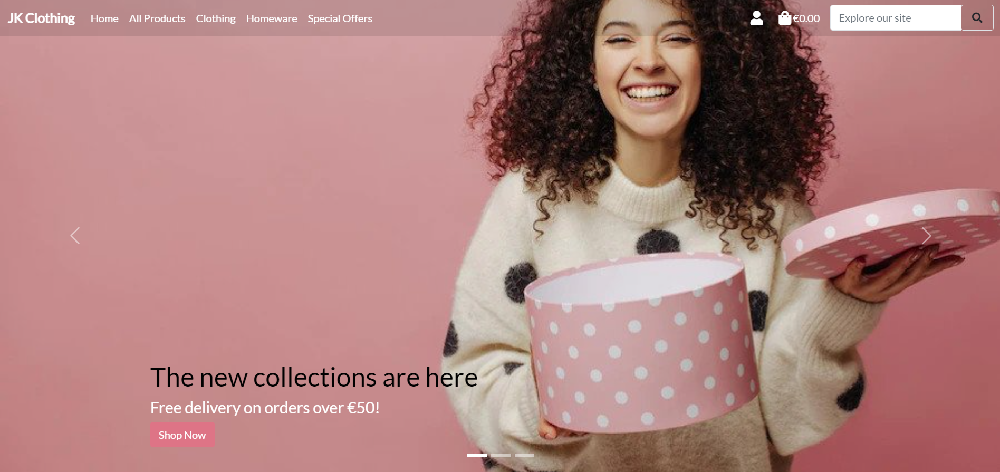

---
## Table of Contents
---
1. [Goals](#goals)
    * [Users Goals](#user-goals)
    * [Developer Goals](#owner-goals)
2. [User Experience](#user-experience)
    * [Target Crowd](#target-crowd)
    * [User Requirements and Expectation](#user-requirements-expectation)
    * [User Stories](#user-stories)
    * [Site Owner Story](#site-owner)
3. [Technologies Used](#technology)
    * [Languages](#languages)
    * [Frameworks and Tools](#frameworks)
4. [Features](#features)
    * [Get Monthly Expenses Data](#get-monthly)
    * [Check Values Entered](#check)
    * [Amend Worksheets](#amend)
    * [Calculate Loss or Savings](#loss-savings)
    * [Calculate and Adjust Budget for the Next Month](#budget)
5. [Validation](#validation)
    * [PEP8 Validation](#pep)
    * [User Stories Testing](#stories)
    * [Site Owner Story Testing](#owner)
6. [Bugs](#bugs)
7. [Deployment](#deployment)
8. [Credits](#credits)
9. [Acknowledgement](#acknowledgement)

---
## Goals
### User/Shoppers Goals
* To be able to view all products and each individual products with its details.
* To quickly identify special offers and clearance items.
* To be able to create an account, log in and log out with email verifications to ensure safety of account.
* To be able to securely checkout when purchasing items from the shop
* To easily recover password in case users forgot it.
* To have a personalized user profile after registering for an account.
* To easily view all the items in the shopping bag.
* To be able to sort out products according to category, prices and alphabetical order.
* To be able to search for products by name or description.
* To easily select size and quantity of a product when purchasing.

### Developer Goals
* To put up a template for in case in the future someone will ask the developer to do an online shop.
---

## User Experience

---
### Target Crowd
* Anyone that loves to shop and are willing to mix and match stuff to show their emotions and feeling through fashion.
* Whoever has the capacity to buy items using a verified credit card.

### User Requirements and Expectations
* Average level of knowledge about computers and online shopping.
* Ability to input data.
* Easy to use
* Easily log in and out
* Easily create an account with email verification.
* Easiyly view all the products and have prompts to easily know whats happening or what has been done.

### User/Shopper Stories
* To be able to view all products and each individual products with its details.
* To quickly identify special offers and clearance items.
* To be able to create an account, log in and log out with email verifications to ensure safety of account.
* To be able to securely checkout when purchasing items from the shop
* To easily recover password in case users forgot it.
* To have a personalized user profile after registering for an account.
* To easily view all the items in the shopping bag.
* To be able to sort out products according to category, prices and alphabetical order.
* To be able to search for products by name or description.
* To easily select size and quantity of a product when purchasing.
* To be able to see purchase history
### Site Owner Story
1. As the site owner, I want to be able to have an admin account so I can add, edit and delete products accordingly.
2. As the site owner, I want to be able to see all the users that has registered for an account and all the orders that has been done on the shop.

---
## Technologies Used
### Languages
* Python
* HTML
* CSS
* Javascript

### Framework and Tools
* Bootstrap5 - for the site design on desktop and mobile to be responsive.
* Fontawesome - for the overall font for the site
* Github - used for storing the code for the site in a repositoty so other developers can see, fork and check it out.
* Gitpod - the IDE used when developing the site
* AWS-S3 - where all the static and media files are stored
* Stripe - the payment system used when checking out
* Heroku - where the app is deployed
---
## Features
### Website Pages
I have structured the website into pages, each with clear, concise structure, information and purpose. I use the Bootstrap grid system throughout, which gave a consistent structure and responsive design.
1. Home/Landing Page: This is the landing page, and the first page the user encounters when they access the site, before they log in/register. This uses a carousel template with some changes from bootstrap5.

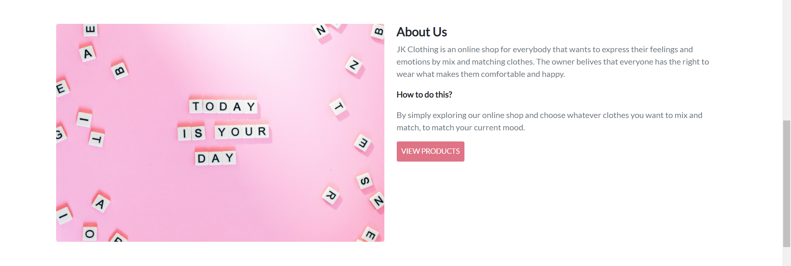

2. Register: This page allows the user to register an account

3. Login: This page allows the user to login to the site
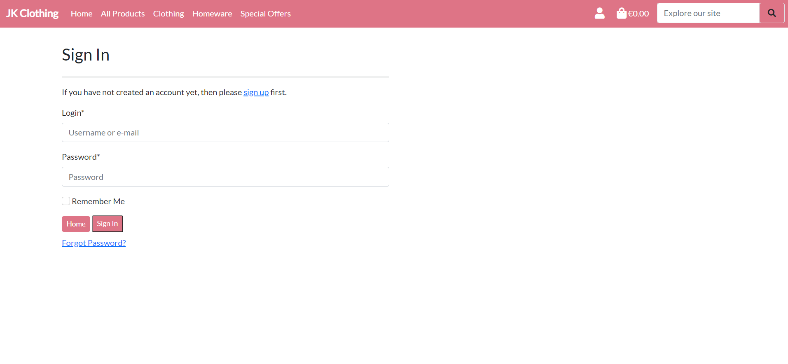
4. Logout: This page allows the user to logout the site
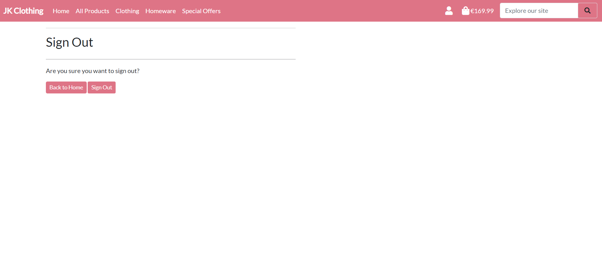
5. All products page: This page shows all the products available on the shop.
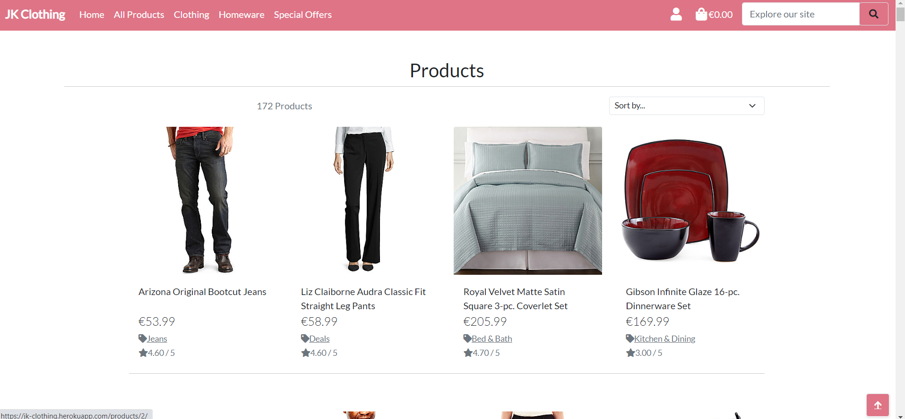
6. Product Details: This page shows the details of a specific product.
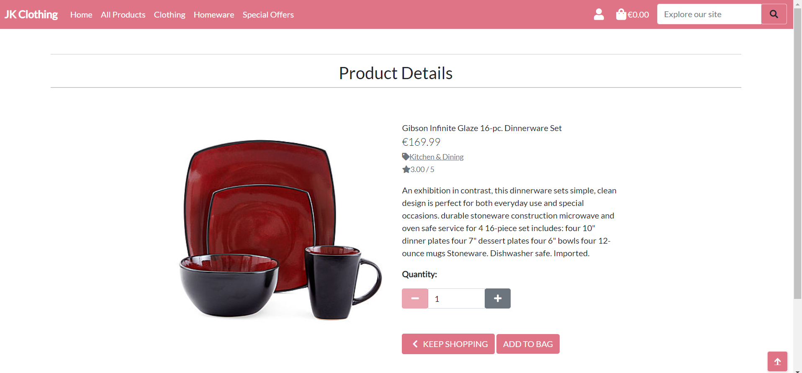
7. Clothing page: This page shows the clothing items on the shop.
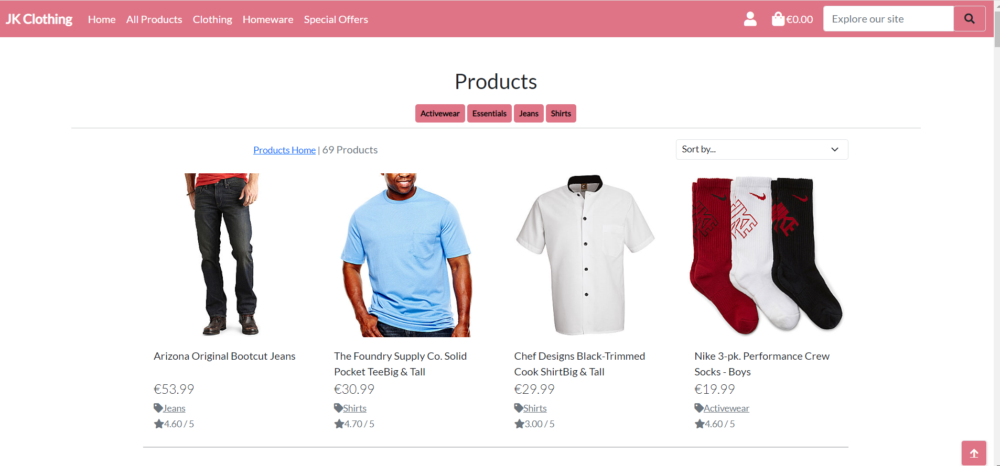
8. Homeware Page: This page shows all the hardware items on the shop.
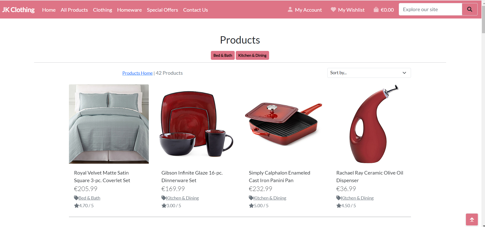
9. Special offers: This page shows all items that are on clearance and special offers/sale.
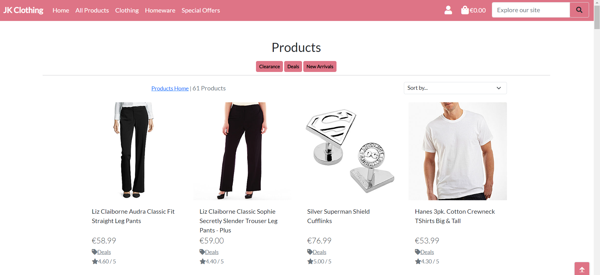
10. Profile: This page is where shoppers with a registered account can edit their profiles accordingly.
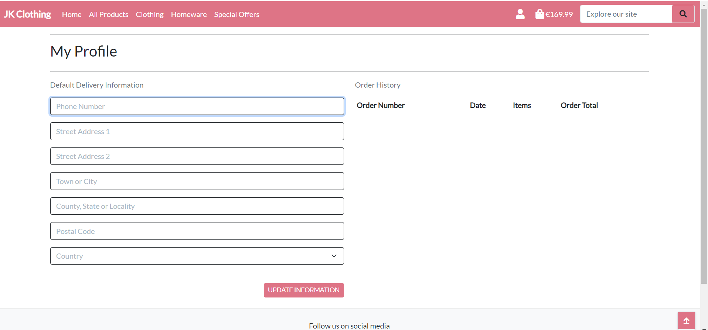
11. Product Management: This page allows the site owner to easily edit, add and delete items from the shop.
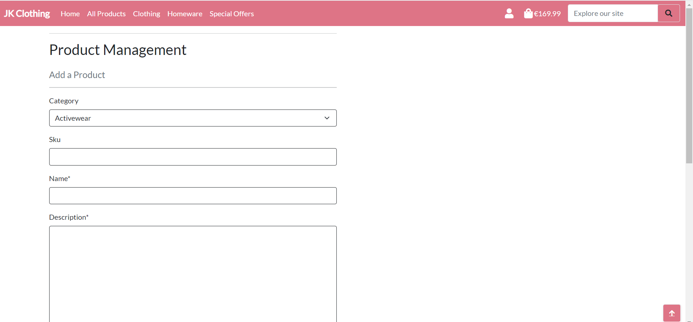
12. Shopping bag: This page shows all the items the shopper wants to buy.
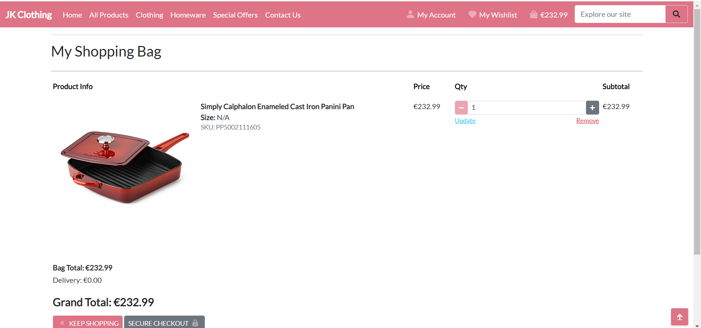
13. Checkout: This page is where users/shoppers put their payment details in order for them to purchase items from the shop.

14. Reset Password: This page is where users/shoppers go to reset their password if they forgot it.

---
## Validation
### PEP8 Validation
* http://pep8online.com/ was use to validate the python code written. Result came back with warnings of line of code too long. I am not sure how to fix them without ruining the site or it might not work if I edit it. Will try and learn how to do this in the future as for now, due to time constraints, I will leave it be as it is not affecting the overall performance of the site.
On one hand, with regards to Unitest, I am still not sure how to do this so I wasnt able to include any of these in the code. Will learn about this more in the future when I have more time to focus on it.
### HTML Validation
* https://validator.w3.org/ was used to check the html files on this site. According to the site, there are 8 errors on this site. 6 of these said the duplicate id's, but when I checked the code, it says that I used duplicate id but this id was used for a dropdown options. 2 of these error said that form are not allowed to be a child of an ul. Tried to fix it but the overall look of the site change, so I kept it knowing and being aware of the error and will learn in the future not to do this. For now, due to time constraint, I will leave it be as the this error is not affecting the seach function of the site.
### CSS Validation
* https://jigsaw.w3.org/css-validator/ was used to check all the CSS files on this site. There were no errors or warnings found.
### JS Validation
* https://jshint.com was used to check the Javascript files used in this site. There were 5 warnings about template literal only available in ES6
## User/Shopper Stories Testing
1. To be able to view all products and each individual products with its details.

| Feature      | Action    | Result    |
| :------------- | :----------: | -----------: |
| Products page | When you opened the app, and click on the all products option a dropdown will show and click all products. Click on the picture of the product and will show the product details.   | Worked    |

2. To quickly identify special offers and clearance items.

| Feature      | Action    | Result    |
| :------------- | :----------: | -----------: |
| Special offers page | When you opened the app, and click on the special offers option a dropdown will show for all the special offers, sale and clearance products.  | Worked    |

3. To be able to create an account, log in and log out with email verifications to ensure safety of account.

| Feature      | Action    | Result    |
| :------------- | :----------: | -----------: |
| My account page | When you opened the app, and click on the my account option a dropdown will show to either log in or sign up.  | Worked    |

4. * To be able to securely checkout when purchasing items from the shop

| Feature      | Action    | Result    |
| :------------- | :----------: | -----------: |
| Checkout page | When you opened the app, and chose an item to add in your bag, and select checkout button. | Worked    |

5. To easily recover password in case users forgot it.

| Feature      | Action    | Result    |
| :------------- | :----------: | -----------: |
| Reset Password page | When you forgot your password when logging in, choose the forgot password option and enter your email and reset password email will be sent. | Worked    |

6. To have a personalized user profile after registering for an account. 

| Feature      | Action    | Result    |
| :------------- | :----------: | -----------: |
| Profile page | When you successfully create an account you can customized and view your user profile in the profile page. | Worked    |