# JK Clothing
---
Develpoer: JKCC

JK Clothing is an online store where user and shoppers can view all the products, sort them out according to category, alphabetically and by their prices. The owner believes fashion is very important to todays world where you can express your feelings and emotions. Mix and match and show what your feeling through fashion. Users and shoppers also have the option to create an account, sign in to same and add products to their bag and securely checking out using stripe. Everyone is welcome and happy shopping! JK Clothing is a business to consumer(B2C) type of Ecommerce business model. B2C businesses sell to their end-user. The B2C model is the most common business model, so there are many unique approaches under this umbrella. Anything you buy in an online store as a consumer — think wardrobe, household supplies,
entertainment — is done as part of a B2C transaction. The decision-making process for a B2C purchase is much shorter than a business-to-business (B2B)
purchase, especially for items that have a lower value. Because of this shorter sales cycle, B2C businesses typically spend less marketing funds to make a sale, but also have a lower average order value and less recurring orders than their B2B counterparts. And B2C doesn’t only include products, but services as well. This online shop uses the stripe payment system that is secure and reliable with confirmation email after successful purchase! Marketing strategies used in this site are the following: having social media accounts, users subscribing for newsletters so site owner can send marketing emails notice to their users, having free delivery if user purchased a certain amount is a good marketing tool as well to make users purchase more. Note: At the moment, after users subscribed for the newsletter, no marketing emails are send yet but can be customized in site owners mailchimp account.

[Go to the website](https://jk-clothing.herokuapp.com/)

---

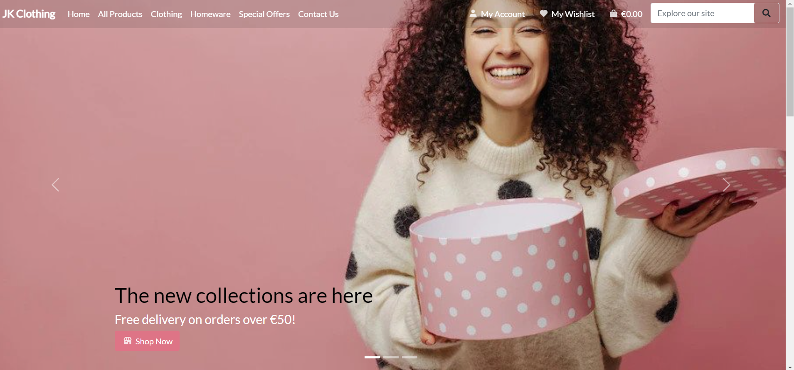

---
## Table of Contents
---
1. [Goals](#goals)
    * [Users Goals](#user-goals)
    * [Developer Goals](#owner-goals)
2. [User Experience](#user-experience)
    * [Target Crowd](#target-crowd)
    * [User Requirements and Expectation](#user-requirements-expectation)
    * [User Stories](#user-stories)
    * [Site Owner Story](#site-owner)
3. [Technologies Used](#technology)
    * [Languages](#languages)
    * [Frameworks and Tools](#frameworks)
    * [Technical Design](#design)
4. [Features](#features)
    * [Home Page](#home)
    * [Register Page](#register)
    * [Login Page](#login)
    * [Logout Page](#logout)
    * [All Products Page](#all-products)
    * [Product Details Page](#product-details)
    * [Clothing Page](#clothing)
    * [Homeware Page](#homeware)
    * [Special Offers Page](#specials)
    * [Profile Page](#profile)
    * [Product Management Page](#management)
    * [Shopping Bag Page](bag)
    * [Checkout Page](#checkout)
    * [Reset Password Page](#reset)
    * [Explore the site](#search)
    * [Contact Us](#contact)
    * [Review/Rating](#review)
    * [Wishlist Page](#wishlist)
    * [Custom 404](#404)
    * [Newsletter](#letter)
5. [Validation](#validation)
    * [PEP8 Validation](#pep)
    * [HTML Validation](#html)
    * [CSS Validation](#css)
    * [Javascript Validation](#js)
    * [User Stories Testing](#stories)
    * [Site Owner Story Testing](#owner)
6. [Bugs](#bugs)
7. [Deployment](#deployment)
8. [Credits](#credits)
9. [Acknowledgement](#acknowledgement)

---
## Goals
### User/Shoppers Goals
* To be able to view all products and each individual products with its details.
* To quickly identify special offers and clearance items.
* To be able to create an account, log in and log out with email verifications to ensure safety of account.
* To be able to securely checkout when purchasing items from the shop
* To easily recover password in case users forgot it.
* To have a personalized user profile after registering for an account.
* To easily view all the items in the shopping bag.
* To be able to sort out products according to category, prices and alphabetical order.
* To be able to search for products by name or description.
* To easily select size and quantity of a product when purchasing.
* To be able to write reviews and ratings on products
* To be able to contact the seller/shop owner for queries, suggestions or comment abou the shop.
* To be able to ad products on wishlist
* To be able to subscribe to a newsletter

### Developer Goals
* To put up a template for in case in the future someone will ask the developer to do an online shop.
---

## User Experience

---
### Target Crowd
* Anyone that loves to shop and are willing to mix and match stuff to show their emotions and feeling through fashion.
* Whoever has the capacity to buy items using a verified credit card.

### User Requirements and Expectations
* Average level of knowledge about computers and online shopping.
* Ability to input data.
* Easy to use
* Easily log in and out
* Easily create an account with email verification.
* Easiyly view all the products and have prompts to easily know whats happening or what has been done.

### User/Shopper Stories
* To be able to view all products and each individual products with its details.
* To quickly identify special offers and clearance items.
* To be able to create an account, log in and log out with email verifications to ensure safety of account.
* To be able to securely checkout when purchasing items from the shop
* To easily recover password in case users forgot it.
* To have a personalized user profile after registering for an account.
* To easily view all the items in the shopping bag.
* To be able to sort out products according to category, prices and alphabetical order.
* To be able to search for products by name or description.
* To easily select size and quantity of a product when purchasing.
* To be able to see purchase history
* To be able to make a review/rating of a product after making an account for the site
* To be able to contact the site owner after making an account for the site
* To be able to add products on a wishlist after making an account for the site
* To be able to subscribe to a newsletter
### Site Owner Story
1. As the site owner, I want to be able to have an admin account so I can add, edit and delete products accordingly.
2. As the site owner, I want to be able to see all the users that has registered for an account and all the orders that has been done on the shop.

---
## Technologies Used
### Languages
* Python-Django
* HTML
* CSS
* Javascript
* Heroku-Postgres
* Mailchimp
* XML sitemaps, robots.txt
* stripe - used for handling payments
* Github - used to mapped out user stories using the project and making an issue templete for the project to help the development of the project and keep track of progress during development. NOTE: the user stories and date line were not coinciding with when I committed the changes about it becauase I didnt have time to start the project again, make an issue template, make a poroject using the KANBAD BOARD to track my progress. BUT I KNOW HOW IMPORTANT THIS IS DURING DEVELOPMENT AND WILL USE IT IN THE FUTURE FOR SURE when starting a new project.

### Framework and Tools
* Bootstrap5 - for the site design on desktop and mobile to be responsive.
* Fontawesome - for the overall font for the site
* Github - used for storing the code for the site in a repositoty so other developers can see, fork and check it out. Inside github, I made a default issue template for user stories of the project and I used kanban board to map out user stories and put it in a project to track progress of development.
* Gitpod - the IDE used when developing the site
* AWS-S3 - where all the static and media files are stored
* Stripe - the payment system used when checking out
* Heroku - where the app is deployed
* draw.io - used for the ERD and website flow chart
### Technical Design
Technical design was based on the most common E-commerce online shop and the botuiqe ado project from Code institute with some modifications and addendums. Lato font family was the typography used in this site and with the color schemes, pink was chosen as the primary color of the site comprising most of it. With regards to the custom 404 page, I used flatuicolors.com to get some colors and combined them together to make the 404 page. Lastly, I used boxicons.com for the moving icons on the buttons and for the icon the browser tab.

Simple ERD
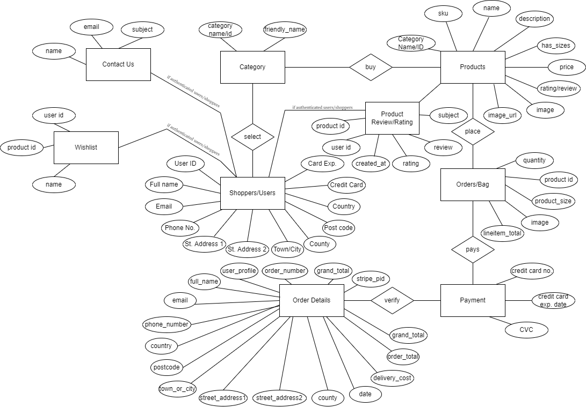

Simple website flow/technical design
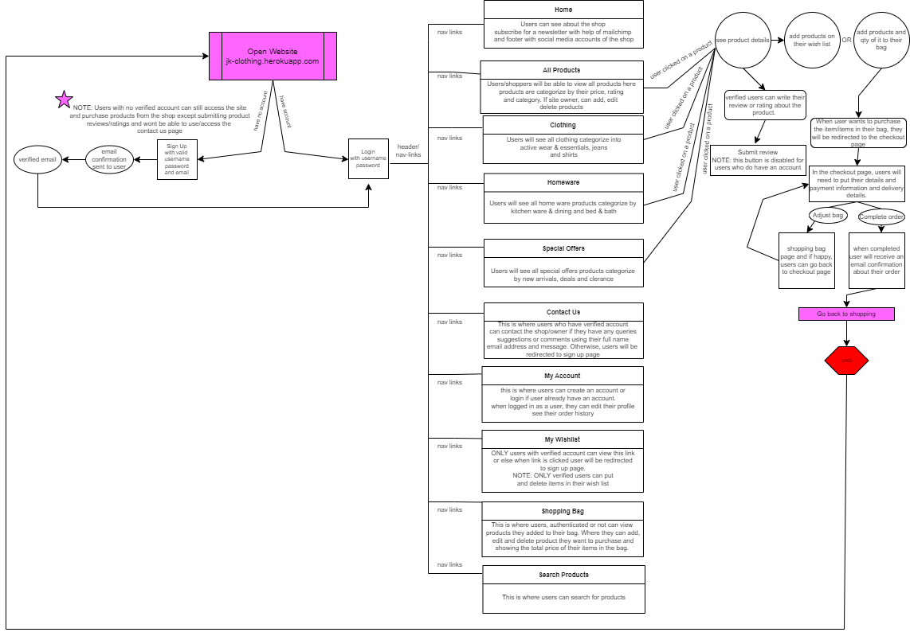

---
## Features
### Website Pages
The website is structured into pages, each with clear, concise structure, information and purpose. I use the Bootstrap grid system throughout, which gave a consistent structure and responsive design.
1. Home/Landing Page: This is the landing page, and the first page the user encounters when they access the site, before they log in/register. This uses a carousel template with some changes from bootstrap5.

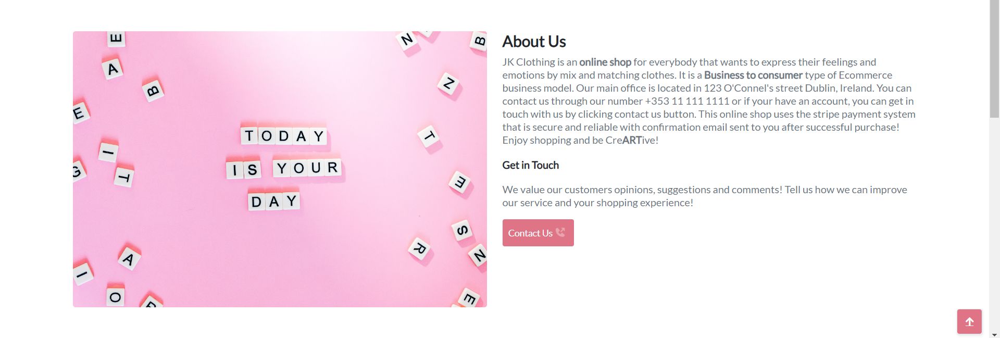
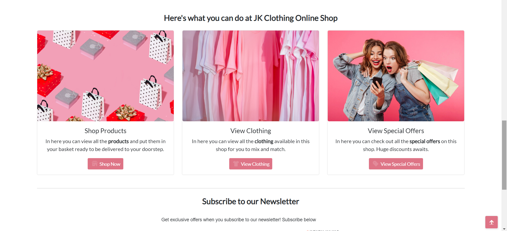
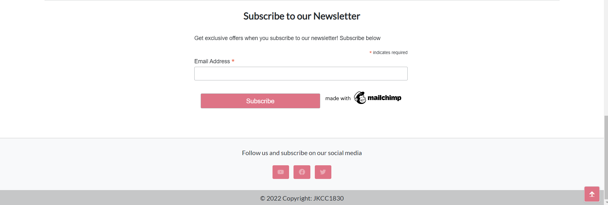
2. Register: This page allows the user to register an account
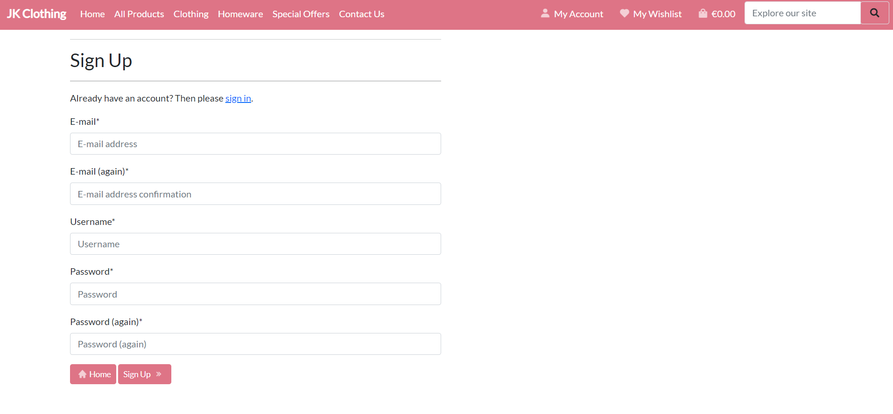
3. Login: This page allows the user to login to the site

4. Logout: This page allows the user to logout the site
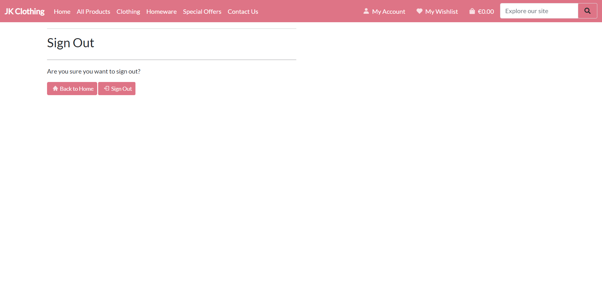
5. All products: This page shows all the products available on the shop.
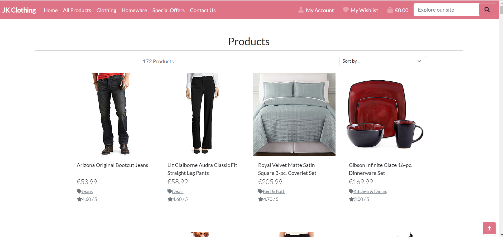
6. Product Details: This page shows the details of a specific product.
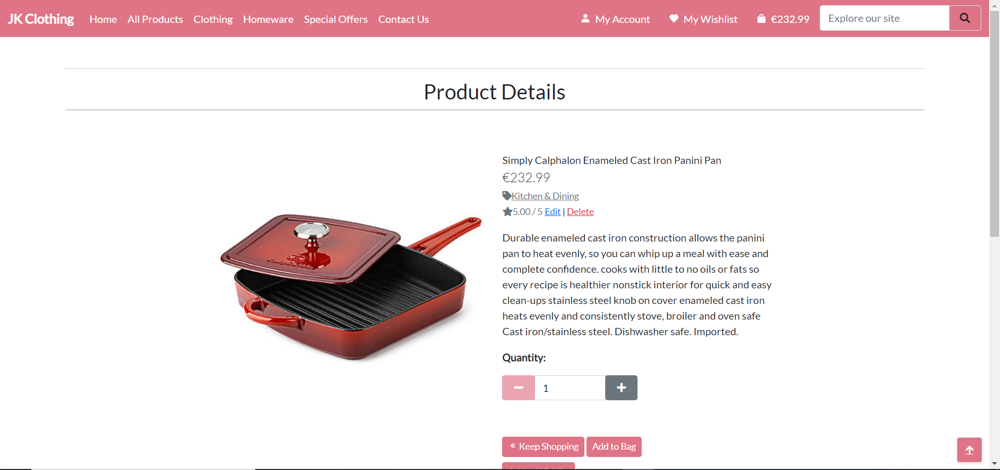
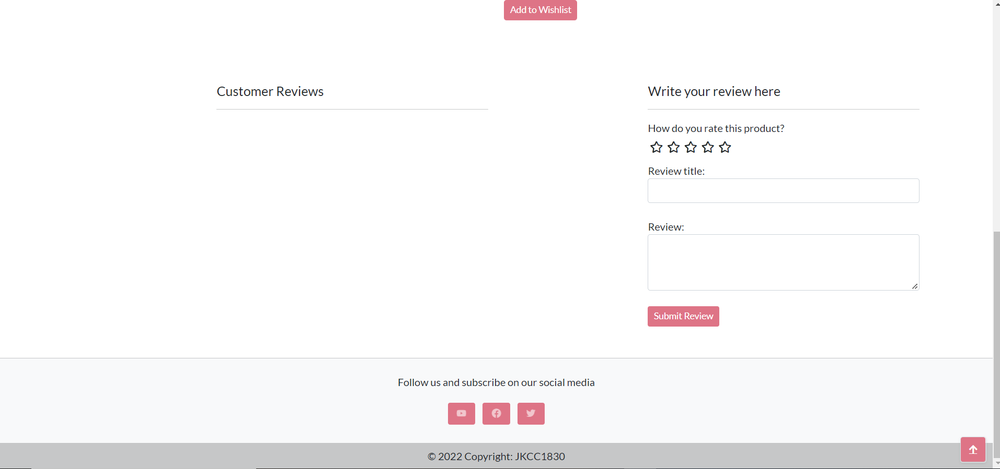
7. Clothing page: This page shows the clothing items on the shop.

8. Homeware Page: This page shows all the hardware items on the shop.

9. Special offers: This page shows all items that are on clearance and special offers/sale.
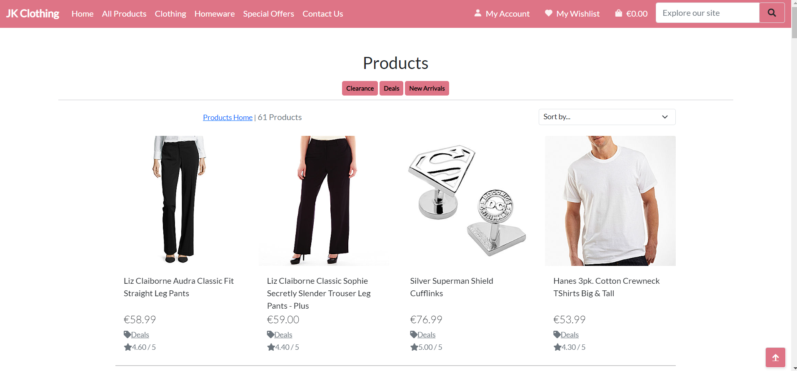
10. Profile: This page is where shoppers with a registered account can edit their profiles accordingly.

11. Product Management: This page allows the site owner to easily edit, add and delete items from the shop.
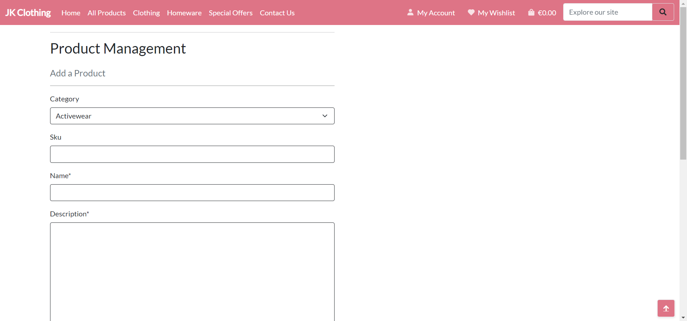
12. Shopping bag: This page shows all the items the shopper wants to buy.

13. Checkout: This page is where users/shoppers put their payment details in order for them to purchase items from the shop.

14. Reset Password: This page is where users/shoppers go to reset their password if they forgot it.

15. Search or explore the site: This page is where users/shoppers go to search for items vie name or description.
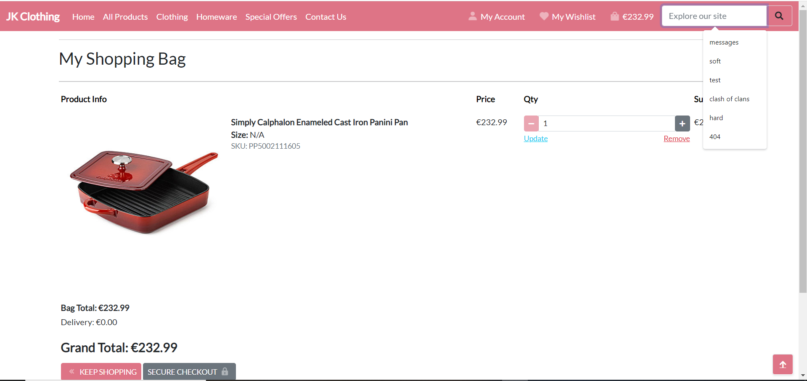
16. Contact Us: This is where login users can contact the shop owner/site admin. Note: For reasons of unwanted users to unnecessarily contact or send unnecessary message to site owner, this option will only be available to verified users. Also, in the future, I want to add a logic where verified users details will be automatically fill the name and email input area.
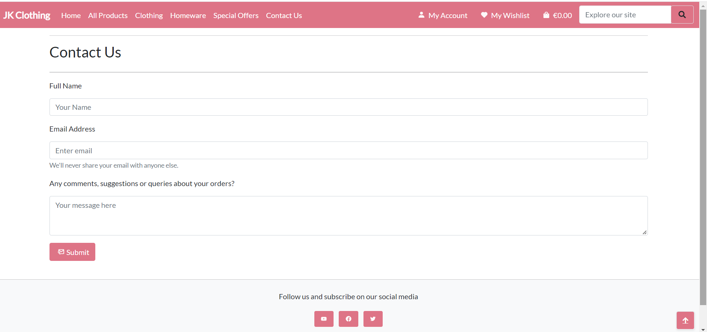
17. Review/rating form: This is where login users can post a review/rating about a product. Note: In the future, I want to add options for login users to update or delete their reviews.

18. Wishlist Page: This is where login users can ad products to their wishlist, view it and delete if needed.
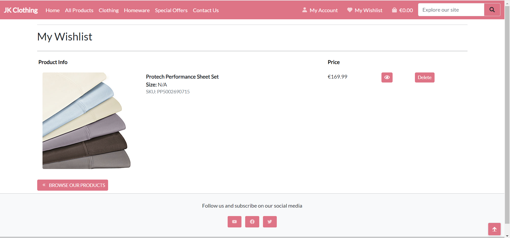
Note: In the future, I want to add a button where users can directly add wishlist product to their shopping bag.
19. Custom 404 page: This page is where users are redirected when they mistyped the URL, the page is temporarily unavailable, or the page no longer exists.
This page will let the user know that there is an error with their request.
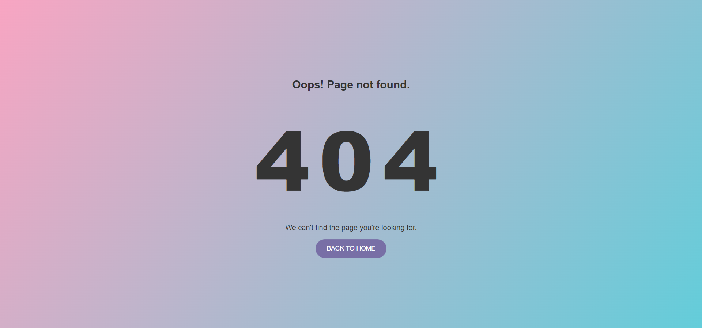
20. Newsletter Page: This section in the home page is where users can subscribe for a newsletter where the site owner can send some marketing emails, ongoing sales. Mailchimp was used to make this part of the site.

---

## Database
* The website is a data-centric one with html, javascript, css used with the bootstrap framework as a frontend
* The backend consists of Python-django, heroku database, aws s3 for the media and static files

## Validation
### PEP8 Validation
* http://pep8online.com/ was use to validate the python code written. There are still warnings of line of code too long. I will leave it be as it is not affecting the overall performance of the site. In time, I will fix this using flake8 and if I have more time.
### HTML Validation
* https://validator.w3.org/ was used to check the html files on this site. According to the site, there are 8 errors on this site. 6 of these said the duplicate id's, but when I checked the code, it says that I used duplicate id but this id was used for a dropdown options. 2 of these error said that form are not allowed to be a child of an ul. Tried to fix it but the overall look of the site change, so I kept it knowing and being aware of the error and will learn in the future not to do this. For now, due to time constraint, I will leave it be as the this error is not affecting functionality of the site.
### CSS Validation
* https://jigsaw.w3.org/css-validator/ was used to check all the CSS files on this site. There were no errors or warnings found.
### JS Validation
* https://jshint.com was used to check the Javascript files used in this site. There were 5 warnings about template literal only available in ES6 but not affecting the functionality so I kept it the same. In time, will learn about this and fix it.
## User/Shopper Stories Manual Testing
1. To be able to view all products and each individual products with its details.

| Feature      | Action    | Result    |
| :------------- | :----------: | -----------: |
| Products page | When you opened the app, and click on the all products option a dropdown will show and click all products. Click on the picture of the product and will show the product details.   | Worked    |

2. To quickly identify special offers and clearance items.

| Feature      | Action    | Result    |
| :------------- | :----------: | -----------: |
| Special offers page | When you opened the app, and click on the special offers option a dropdown will show for all the special offers, sale and clearance products.  | Worked    |

3. To be able to create an account, log in and log out with email verifications to ensure safety of account.

| Feature      | Action    | Result    |
| :------------- | :----------: | -----------: |
| My account page | When you opened the app, and click on the my account option a dropdown will show to either log in or sign up. After creating an account, you will receive a verification email, after verifying, you can log in.   | Worked    |

4. * To be able to securely checkout when purchasing items from the shop

| Feature      | Action    | Result    |
| :------------- | :----------: | -----------: |
| Checkout page | When you opened the app, and chose an item to add in your bag, and select checkout button. After that an email confirmation will be receive in the users email. | Worked    |

5. To easily recover password in case users forgot it.

| Feature      | Action    | Result    |
| :------------- | :----------: | -----------: |
| Reset Password page | When you forgot your password when logging in, choose the forgot password option and enter your email and reset password email will be sent. | Worked    |

6. To have a personalized user profile after registering for an account. 

| Feature      | Action    | Result    |
| :------------- | :----------: | -----------: |
| Profile page | When you successfully create an account you can customized and view your user profile in the profile page. | Worked    |

7. To easily view all the items in the shopping bag.

| Feature      | Action    | Result    |
| :------------- | :----------: | -----------: |
| Checkout or Shopping Bag Page | There are two ways to see all the items you put in your bag. One, is to click onto the basket icon on the upper right hand side, and second is when you are checking out, you will see a preview of all the items you ordered. | Worked    |

8. To be able to sort out products according to category, prices, ratings and alphabetical order.

| Feature      | Action    | Result    |
| :------------- | :----------: | -----------: |
| All Products Page | After clicking the all products options, you will see a dropdown option where you can sort items according to their category, price, rating and name. | Worked    |

9. To be able to search for products by name or description.

| Feature      | Action    | Result    |
| :------------- | :----------: | -----------: |
| Search/Explore our site  | You can see this on the upper right hand side of the site where you can type in keywords and description and products with said desctiption or name will show on the screen. | Worked    |

10. To easily select size and quantity of a product when purchasing.

| Feature      | Action    | Result    |
| :------------- | :----------: | -----------: |
| Product Details Page  | When you clicked onto one item, it will bring you to the product details page, where you can select sizes if available for that item and the quantity you want to buy. | Worked    |

11. To be able to see purchase history

| Feature      | Action    | Result    |
| :------------- | :----------: | -----------: |
| Profile Page  | When you have an account and use it to purchase multiple times on the shop, when you go to your profile page, it will show your purchase history. | Worked    |

12. To be able to make a review/rating of a product after making an account for the site

| Feature      | Action    | Result    |
| :------------- | :----------: | -----------: |
| Product Detail page  | When login as a verified user, you can add review/rating of a certain product. | Worked    |

13. To be able to contact the site owner/shop. Note: making an account for the site is required to do this

| Feature      | Action    | Result    |
| :------------- | :----------: | -----------: |
| Contact Us page  | When login as a verified user, you can send a message to the shop owner. | Worked    |

14. To be able to add products on a wishlist. Note:making an account for the site to do this

| Feature      | Action    | Result    |
| :------------- | :----------: | -----------: |
| Wishlist Page  | When login as a verified user, you can add products to the wishlist and delete them if needed. | Worked    |

15. To be able to subscribe to a newsletter

| Feature      | Action    | Result    |
| :------------- | :----------: | -----------: |
| Newsletter  | Scroll down to the end of the home page and enter your email to subscribe to newsletters | Worked    |

### Site Owner Story Testing
1. As the site owner, I want to be able to have an admin account so I can add, edit and delete products accordingly.

| Feature      | Action    | Result    |
| :------------- | :----------: | -----------: |
| Product Management | When the site owner has a admin account access, he or she will be able to add, edit, delete products on the product management option or when logged in as a owner and validated superuser, all the items will have an edit or delete options on them.   | Worked    |

2. As the site owner, I want to be able to see all the users that has registered for an account and all the orders that has been done on the shop.

| Feature      | Action    | Result    |
| :------------- | :----------: | -----------: |
| Admin Page | This is possible when you add /admin to the website url, and enter your admin login. Tested using the superuser I made.   | Worked    |

---
## Bugs
* The previous submitted project, there was no email confirmation sent to users after a successful purchase, but was able to fix this using the django email message class. I added it in the the checkout_success view.py in the checkout app and it worked on testing. Made a purchase using the stripe and I received an email confirming my purchase.
* During development or when using the virtual environment, I can still see the product sizes for products that have sizes but after deploying the site, the sizes option disappeared. Will try and fix it again if I had more time to learn or check where the problem was.
---
## Mock up social media product page
This section shows the fake social media groups and accounts I made just for the site. You can access this by pressing onto the social media icon on the footer area and it will redirect you to the said pages.

Mock Facebook Page

Mock Twitter Page

Mock Youtube channel

## Depolyment
### The website was deployed using Heroku by following these steps:

1. Use the "pip3 freeze > requirements.txt" command in the terminal to save any libraries that need to be installed in the file.
2. Login or create a Heroku account
3. Click the "new" button in the upper right corner and select "create new app".
4. Choose an app name and your region and click "Create app".
5. After creating an app, due to some security reasons, heroku doesnt allow users to connect their github repository for deployment. Thus, using the gitpot terminal, type: heroku login -i and logged in with my credentials
6. After this I typed: heroku git:remote -a jk-clothing
8. Then typed: git push heroku main
9. Wait for the app to build and deploy the app heroku and in the gitpod terminal you can use control+mouse left click to open the deployed site. Or you can just open your heroku account, got the apps sections, click on the app name and click open app button found on the right top side.

### You can fork the repository by following these steps:

1. Go to the GitHub repository.
2. Click on the Fork button in the upper right-hand corner.

### You can clone the repository by following these steps:

1. Go to the GitHub repository
2. Locate the Code button above the list of files and click it
3. Select if you prefer to clone using HTTPS, SSH, or Github CLI and click the copy button to copy the URL to your clipboard.
4. Open Git Bash
5. Change the current working directory to the one where you want the cloned directory.
6. Type git clone and paste the URL from the clipboard ($ git clone https://github.com/YOUR-USERNAME/YOUR-REPOSITORY)
7. Press Enter to create your local clone.

---
## Credits
* Making this app was inspired by the Boutique Ado project provided by the Code institute.
### Code
* The codes were based and modified from the Boutique Ado project of the Code institute.
* Django documentations
* Stripe documentations
### Images
* The images used in this site was from the Boutique Ado project by the Code institute and unsplash.com for the photos for the home page. 
### Overall UI
* This was inspired by the carousel template in bootstrap with some modifications.

---
## Acknoledgements
### I would like to take this opportunity to thank:
* Code institute for the tutorial on how python-django works.
* Google
* Youtube
* boxicons.com - used for the button icons on the site
* draw.io - used for the ERD and web design process
* Lastly, I would like to thank JK, you know who you are. Thanks for the advice, for cheering me up when I'm stressed out and thank you for your belief in me that I can do this course and succeed.
* flatuicolors.com - for the colors I used for the customs 404 page

## Plans for the Future
There are things that I want to add onto this site that might improve the overall experience of users. First, is to add a function that will sort out the items from male and female and kids items so it is easier for the users to browse the site. Second, is to add like a currency option so user from all over the world can choose whats is appropriate for them. Third, is to add like a promo code functionality where users can use promo code to have some discounts and buy more items in return. Lastly, for marketing purposes and for users to buy more, I would like to add a function users can buy 1 item and get a half price for the second item and sending newsletters to subscribe users for them to be notified or new arrivals, discounts and ongoing sales on the shop and to send promo codes to subscribe users to entice them to go to the site and buy more products.
